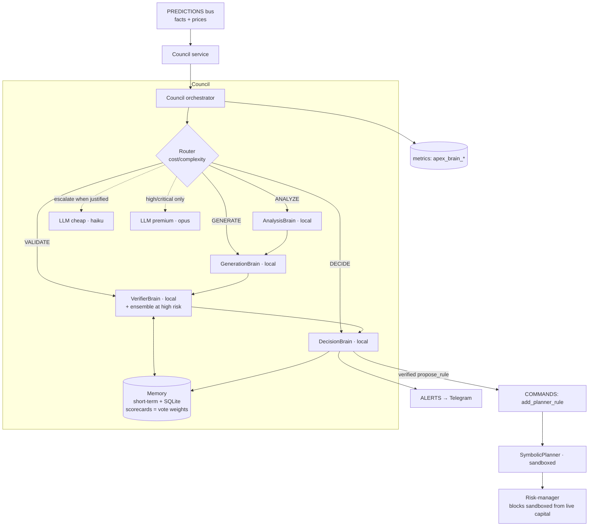

# Distributed Intelligence — the "More Brains" Layer

APEX no longer relies on a single model. Decisions are made by a **Council** of
single-responsibility brains that collaborate, verify each other, and degrade
gracefully. It is **additive and opt-in** (`APEX_ENABLE_COUNCIL=true`); off, the
system behaves exactly as before. It runs **100% free on local brains** and only
touches paid LLM tiers when you set `ANTHROPIC_API_KEY` *and* the task justifies
the cost.

## Architecture



## The brains (single responsibility each)

| Brain | Kind | Tier | Job |
|---|---|---|---|
| `AnalysisBrain` | ANALYZE | local | Reads prices → direction, regime, RSI, volatility, confidence (reuses APEX indicators/predictors) |
| `GenerationBrain` | GENERATE | local | Turns an assessment into a candidate **sandboxed** planner rule |
| `VerifierBrain` | VALIDATE | local | **Self-critique** — tries to *refute* a proposal (sandbox, caps, direction consistency, fact validity) |
| `DecisionBrain` | DECIDE | local | Aggregates analysis+proposal+verdict → final go/hold |
| `LLMBrain(cheap)` | A/G/V | cheap | Optional haiku tier — only routed at MEDIUM+ risk, only with a key |
| `LLMBrain(premium)` | A/G/V | premium | Optional opus tier — only at HIGH/CRITICAL risk |

## Contracts

Every brain implements the same interface and **never raises**:

```python
async def handle(task: BrainTask) -> BrainResult   # see apex/brains/contracts.py
```

- `BrainTask`: `kind` (analyze/generate/validate/decide), `payload`, `context`,
  `risk` (low→critical), `budget_tokens`, `deadline_s`, `session`.
- `BrainResult`: `output`, `confidence` 0..1, `cost` (tier+tokens+usd),
  `latency_s`, `verified`, `abstained`, `error`. A brain that can't help
  returns `BrainResult.abstain(...)` — it does not throw.
- `Decision` (Council output): `output`, `confidence`, `verified`,
  `brains_used`, `consensus`, `cost`, `fallbacks`.

## How they collaborate

1. **Routing by cost/complexity** (`router.py`). Risk caps the max tier
   (LOW→local only, MEDIUM→cheap, HIGH/CRITICAL→premium). The most capable
   *healthy* brain runs first, then degrades to a free local brain — so simple
   tasks never spend premium tokens and complex ones still have a free fallback.
2. **Fallback chains** (`council.run`). Abstain/error/over-budget → next brain.
   Every fallback is logged, metered, and listed in the `Decision`. Never silent.
3. **Verification before shipping** (`council._verify`). The local verifier is a
   **mandatory gate**; HIGH/CRITICAL adds an ensemble and requires **weighted
   consensus** (weights = per-brain scorecards from long-term memory). Nothing
   high-risk ships unverified.
4. **Memory** (`memory.py`). Short-term session context + long-term SQLite
   (stdlib, zero-dep) of decisions and **scorecards** — brains that prove
   reliable earn more vote over time.
5. **Cost awareness** (`cost.py`). Per-task token budget gates premium
   escalation; a global meter feeds `apex_brain_cost_usd_total` for spend alerts.

## Quality measurement

- Each brain's reliability is an EWMA **scorecard** in long-term memory, updated
  after every deliberation (e.g. a generator whose proposal passes verification
  scores up). Scorecards are the ensemble vote weights — the council literally
  learns which brains to trust.
- Metrics: `apex_brain_tasks_total{kind,brain}`, `apex_brain_fallbacks_total`,
  `apex_brain_verifications_total{result}`, `apex_brain_decisions_total{action}`,
  `apex_brain_consensus_ratio`, `apex_brain_cost_usd_total`.

## Safety / backward compatibility

- The council only emits **sandboxed** planner rules. The risk-manager already
  blocks sandboxed rules from real capital until they pass backtest + 24h paper.
- Off by default. Enabling it cannot place orders directly — it can only propose
  rules that flow through the *existing* risk gate.
- Zero-cost unless you opt into LLM tiers.
